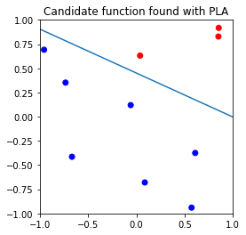
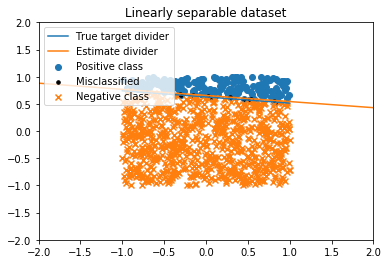
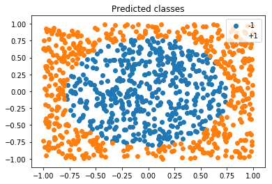
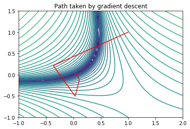
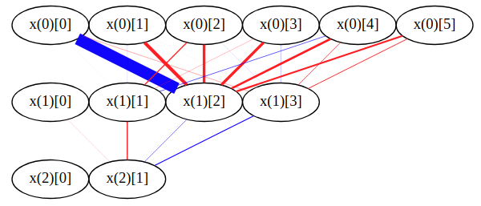
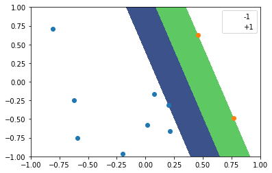
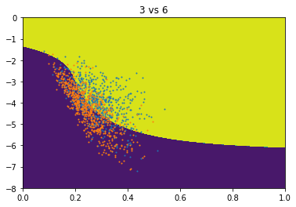
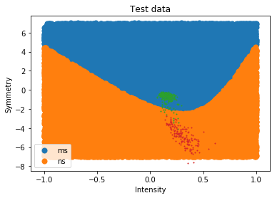
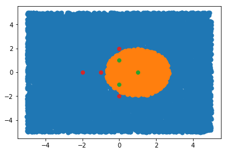
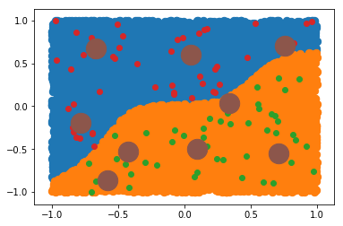

# Caltech: Learning From Data

Online Machine Learning course from Caltech that I have done.  
Course website: https://work.caltech.edu/telecourse.html

**Lectures/slides:** https://work.caltech.edu/lectures.html

## Homework 1

https://work.caltech.edu/homework/hw1.pdf

* Implemented Perceptron Learning Algorithm from scratch

## Homework 2

https://work.caltech.edu/homework/hw2.pdf

* Implemented Least Squares based Linear Regression classifier from scratch

* Used nonlinear transformations for linear regression

## Homework 3

https://work.caltech.edu/homework/hw3.pdf

* Investigated VC dimension and growth function for perceptrons and other classifiers

## Homework 4

https://work.caltech.edu/homework/hw4.pdf

* Investigated various VC dimension bounds
* Investigated bias/variance decomposition for linear models

## Homework 5

https://work.caltech.edu/homework/hw5.pdf

* Implemented logistic regression using gradient descent and coordinate descent

## Homework 6

https://work.caltech.edu/homework/hw6.pdf

* Investigated effect of L2 regression on Linear Regression
* Computed Legendre Polynomials using Gram-Schmidt orthogonalization with SymPy
* Implemented neural network forward mode
* Implemented Neural Network Backpropagation from scratch using Gradient Descent

## Homework 7

https://work.caltech.edu/homework/hw7.pdf

* Investigated various train/test splitting schemes
* Looked into k-fold cross validation for model selection
* Implemented hard-margin SVM from scratch using quadratic programming

## Homework 8

https://work.caltech.edu/homework/hw8.pdf

* Learned about SVM with soft-margins
* Learned about SVM with RBF kernel

## Final

https://work.caltech.edu/homework/final.pdf

* Investigated more about L2 regularization and linear regression with nonlinear transforms

* More SVMs. Polynomial kernels, RBF kernel.

* Implemented K Means clustering algorithm from scratch

* Used Regular Radial Basis Functions in combination with kmeans for
  classification, and compared the resutls with SVM with RBF kernel.

